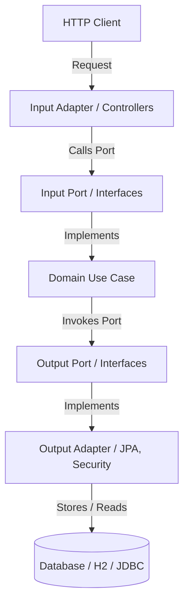

# Enhauthserv Project Documentation Index

Welcome to the comprehensive technical documentation for **Enhauthserv**, a Spring Boot 3.5.13 / Java 25 OAuth 2.1 and OpenID Connect (OIDC) server.

This project is built using a strict Hexagonal (Ports & Adapters) architecture and provides built-in multi-tenancy, dynamic claims resolution based on user profiles, and granular token lifetime and scope controls.

Use the links below to navigate the core components, features, and business logic of the system:

---

## 🗺️ Documentation Modules

### 🏛️ [1. Architecture & Clean Decoupling](file:///Users/bangun.saputra/Bangun/Projects/enhauthserv/docs/architecture.md)
Learn about the Hexagonal architecture rules, Ports and Adapters, use-case wiring via [UseCaseWiringConfig.java](file:///Users/bangun.saputra/Bangun/Projects/enhauthserv/src/main/java/io/github/edmaputra/enhauthserv/config/UseCaseWiringConfig.java), and the constraints programmatically enforced by [ArchitectureBoundariesTests.java](file:///Users/bangun.saputra/Bangun/Projects/enhauthserv/src/test/java/io/github/edmaputra/enhauthserv/ArchitectureBoundariesTests.java).

### 🏢 [2. Multi-Tenancy Engine](file:///Users/bangun.saputra/Bangun/Projects/enhauthserv/docs/multitenancy.md)
Detailed walkthrough of request-based tenant resolution (Header vs Path prefix), HTTP header trust validation, machine-endpoint path rewriting, and tenant isolation logic in registered client repositories, authorizations, and consents.

### 🛡️ [3. Token Issuance Policies](file:///Users/bangun.saputra/Bangun/Projects/enhauthserv/docs/token_policies.md)
Understand token configurations, lifetime controls via `app.token.*` properties, access token validation for machine-to-machine (`client_credentials`) flows, and the refresh token rotation strategy.

### 🏷️ [4. Dynamic Claim Resolution](file:///Users/bangun.saputra/Bangun/Projects/enhauthserv/docs/custom_claims.md)
See how custom profile attributes are mapped to JWT tokens and OIDC endpoints. Explains the relationship between user profiles, attributes, and inclusion rules targeting `USERINFO`, `ID_TOKEN`, and `ACCESS_TOKEN`.

### 🔌 [5. API Endpoints Specification](file:///Users/bangun.saputra/Bangun/Projects/enhauthserv/docs/api_endpoints.md)
Comprehensive technical overview of OIDC and OAuth 2.1 endpoints (Token, Introspection, Revocation, UserInfo, Logout, Authorization Code, and PKCE), authentication rules, and error patterns.

### 🗄️ [6. Database Schema & Persistence](file:///Users/bangun.saputra/Bangun/Projects/enhauthserv/docs/database_schema.md)
Database design details, entity definitions, relationships, and the list of Flyway schema migration scripts.

---

## 🚀 Architectural Layout At a Glance

The diagram below provides a high-level representation of how requests flow from the edge adapters, through input ports, into use cases, and finally save state via output ports/adapters:

