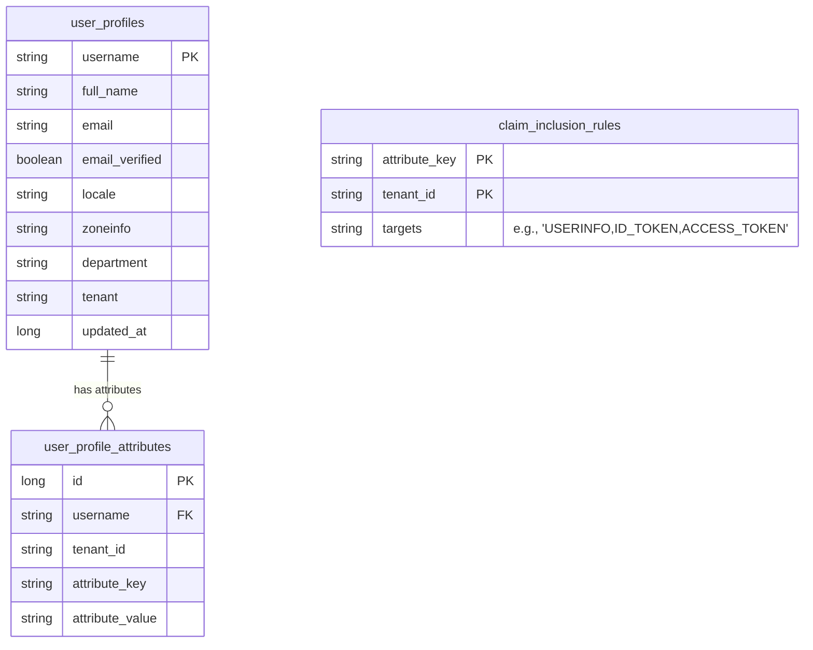

# 🏷️ Dynamic Claim Resolution

Enhauthserv features a dynamic custom claims architecture. Administrators can define custom user profile attributes and control exactly where those attributes are mapped in security contexts (Access Tokens, ID Tokens, or OIDC UserInfo payloads) without writing Java code.

---

## 🗄️ Relational Schema & Entities

The custom claims system revolves around three core database entities:



1. **[UserProfile](file:///Users/bangun.saputra/Bangun/Projects/enhauthserv/src/main/java/io/github/edmaputra/enhauthserv/entity/UserProfile.java)**: Stores standard OpenID Connect attributes like username, full name, email, verification status, locale, time zone (`zoneinfo`), company department, and tenant association.
2. **[UserProfileAttribute](file:///Users/bangun.saputra/Bangun/Projects/enhauthserv/src/main/java/io/github/edmaputra/enhauthserv/entity/UserProfileAttribute.java)**: A dictionary of key-value pairs representing custom details for a user (e.g. `favorite_color: blue`, `region: apac`, `employee_level: senior`).
3. **[ClaimInclusionRule](file:///Users/bangun.saputra/Bangun/Projects/enhauthserv/src/main/java/io/github/edmaputra/enhauthserv/entity/ClaimInclusionRule.java)**: Defines the mapping configuration for an attribute key. It maps the key to a list of output targets.

---

## 🎯 Claim Targets

The `targets` column inside the `claim_inclusion_rules` table contains comma-separated values of target destinations mapped to the **[ClaimTarget](file:///Users/bangun.saputra/Bangun/Projects/enhauthserv/src/main/java/io/github/edmaputra/enhauthserv/entity/ClaimTarget.java)** enum:

- **`USERINFO`**: Included when calling the OIDC `/userinfo` endpoint.
- **`ID_TOKEN`**: Included inside the OpenID Connect Id Token issued during the authorization code exchange.
- **`ACCESS_TOKEN`**: Minted directly inside the JWT Access Token claims.

---

## 🛡️ Reserved Claims Protection

To guarantee OAuth2/OIDC spec compliance, the core use case **[UserClaimsUseCase](file:///Users/bangun.saputra/Bangun/Projects/enhauthserv/src/main/java/io/github/edmaputra/enhauthserv/application/usecase/claims/UserClaimsUseCase.java)** enforces a strict blacklist of reserved JWT/OIDC claims. 

Even if a rule is configured for these keys, they will **never** be overwritten by user attributes:
- `sub`, `iss`, `aud`, `exp`, `iat`, `nbf`, `jti`, `scope`, `client_id`, `azp`, `token_type`
- `auth_time`, `nonce`, `at_hash`, `c_hash`, `sid`, `amr`, `acr`

---

## ⚙️ Integration with Spring Security

The custom claims engine is wired into the token generation pipeline inside [SecurityConfig.java](file:///Users/bangun.saputra/Bangun/Projects/enhauthserv/src/main/java/io/github/edmaputra/enhauthserv/config/SecurityConfig.java):

### 1. UserInfo Endpoint Mapper
The `userInfoMapper` bean intercepts OIDC user info queries, calls `UserClaimsUseCase.getClaims(username, ClaimType.USERINFO)`, and appends the resolved attributes to the standard profile claims payload:
```java
claims.put("sub", username);
claims.put("name", userProfile.fullName());
claims.put("email", userProfile.email());
// ... other standard claims
claims.putAll(userClaimsInputPort.getClaims(username, ClaimType.USERINFO));
```

### 2. Token Customizer
The `jwtTokenCustomizer` bean intercepts JWT issuance during authorization code and refresh token exchanges:
- For **ID Tokens**, it inserts claims matching `ClaimType.ID_TOKEN`.
- For **Access Tokens**, it inserts claims matching `ClaimType.ACCESS_TOKEN`.
```java
if (OidcParameterNames.ID_TOKEN.equals(context.getTokenType().getValue())) {
  context.getClaims().claims((claims) ->
      claims.putAll(userClaimsInputPort.getClaims(username, ClaimType.ID_TOKEN)));
  return;
}

if (OAuth2TokenType.ACCESS_TOKEN.equals(context.getTokenType())) {
  context.getClaims().claims((claims) ->
      claims.putAll(userClaimsInputPort.getClaims(username, ClaimType.ACCESS_TOKEN)));
}
```
