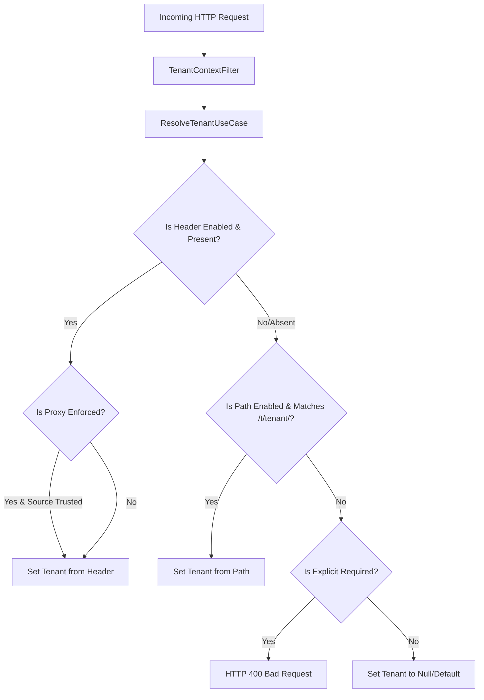

# 🏢 Multi-Tenancy Engine

Enhauthserv contains a robust, dynamic multi-tenancy engine. It isolates users, clients, consents, and active authorization tokens per tenant using a shared-database (discriminator column) strategy.

---

## 🚦 Tenant Resolution Lifecycle

Each incoming HTTP request is intercepted by the [TenantContextFilter](file:///Users/bangun.saputra/Bangun/Projects/enhauthserv/src/main/java/io/github/edmaputra/enhauthserv/tenant/TenantContextFilter.java) at the highest filter precedence. The filter delegates to the [ResolveTenantUseCase](file:///Users/bangun.saputra/Bangun/Projects/enhauthserv/src/main/java/io/github/edmaputra/enhauthserv/application/usecase/tenant/ResolveTenantUseCase.java) to determine the tenant context.



### 1. HTTP Header Resolution
- **Header Name**: Default is `X-Tenant-ID` (configurable via `tenant.resolution.header-name`).
- **Proxy Trust Boundaries**:
  - In production, enable `tenant.resolution.enforce-trusted-proxy-for-header=true`.
  - The server will verify if the request source IP (`remoteAddr`) matches the configured set of IP addresses in `tenant.resolution.header-trusted-sources` (defaults to loopback interfaces). If the source is untrusted, the header is ignored.

### 2. Path Prefix Resolution
- If header resolution fails or is disabled, the engine falls back to URL path matching.
- Any request starting with the prefix `/t/{tenant}/...` will resolve the `{tenant}` value as the tenant identifier.
- Path identifiers must match the regex `^[A-Za-z0-9_-]+$`.

---

## 🔄 Machine Endpoint Path Rewriting

Spring Authorization Server expects OAuth2 machine-to-machine endpoints (like introspection and revocation) to reside on standard, un-namespaced paths like `/oauth2/introspect` and `/oauth2/revoke`.

To support tenant namespaces via paths, the [ResolveTenantUseCase](file:///Users/bangun.saputra/Bangun/Projects/enhauthserv/src/main/java/io/github/edmaputra/enhauthserv/application/usecase/tenant/ResolveTenantUseCase.java) matches machine endpoints using a special pattern:
- Introspection URL: `/t/{tenant}/oauth2/introspect`
- Revocation URL: `/t/{tenant}/oauth2/revoke`

When matched, the [TenantContextFilter](file:///Users/bangun.saputra/Bangun/Projects/enhauthserv/src/main/java/io/github/edmaputra/enhauthserv/tenant/TenantContextFilter.java):
1. Resolves `{tenant}` as the current active tenant.
2. Wraps the request in a `MachineEndpointRewriteRequest` which overrides `getRequestURI()`, `getServletPath()`, and `getRequestURL()` to present the rewritten standard path (e.g. `/oauth2/introspect`) to Spring.
3. Forwards the request down the filter chain.

---

## 🗂️ ThreadLocal Context Isolation

Once a tenant is resolved, it is stored in [TenantContext.java](file:///Users/bangun.saputra/Bangun/Projects/enhauthserv/src/main/java/io/github/edmaputra/enhauthserv/tenant/TenantContext.java) inside a `ThreadLocal` wrapper:

```java
public final class TenantContext {
  private static final ThreadLocal<String> CURRENT_TENANT = new ThreadLocal<>();
  
  public static void setCurrentTenant(String tenantId) {
    CURRENT_TENANT.set(tenantId);
  }
  
  public static String getCurrentTenant() {
    return CURRENT_TENANT.get();
  }
}
```

> [!IMPORTANT]
> The context filter guarantees clean-up. Inside a `try ... finally` block, the filter executes `TenantContext.clear()` after the request completes, preventing memory leaks and cross-request state contamination.

---

## 💾 Partitioned Persistence Adapters

To isolate authorization data, Enhauthserv wraps Spring Authorization Server's standard JDBC-backed services with tenant-aware adapters. These classes intercept read and write commands and inject the tenant discriminator `tenant_id`:

### [TenantAwareRegisteredClientRepository](file:///Users/bangun.saputra/Bangun/Projects/enhauthserv/src/main/java/io/github/edmaputra/enhauthserv/tenant/TenantAwareRegisteredClientRepository.java)
- **Save**: Saves the client definition and updates `oauth2_registered_client.tenant_id` to the current tenant.
- **Lookup**: Filters database queries using `where client_id = ? and tenant_id = ?`.

### [TenantAwareOAuth2AuthorizationService](file:///Users/bangun.saputra/Bangun/Projects/enhauthserv/src/main/java/io/github/edmaputra/enhauthserv/tenant/TenantAwareOAuth2AuthorizationService.java)
- **Save**: Restricts the OAuth2 authorization record (access token, refresh token state) with the tenant context.
- **Lookup**: Prevents token operations (such as swapping codes or refreshing tokens) if the token is associated with a different tenant.

### [TenantAwareOAuth2AuthorizationConsentService](file:///Users/bangun.saputra/Bangun/Projects/enhauthserv/src/main/java/io/github/edmaputra/enhauthserv/tenant/TenantAwareOAuth2AuthorizationConsentService.java)
- **Save & Lookup**: Partition user consent choices by tenant.
