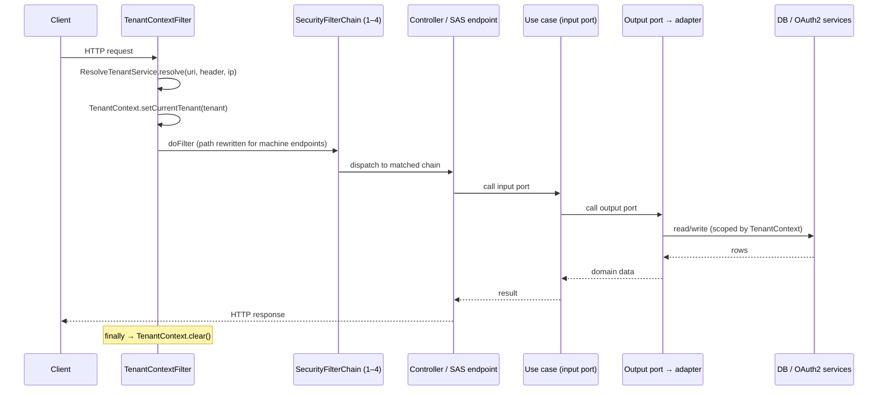

# Architecture

EnhAuthServ follows a **Hexagonal (Ports & Adapters)** architecture. The boundaries are enforced automatically by `ArchitectureBoundariesTests` (ArchUnit), so the layering below is not just a convention — a violating commit fails the build.

## Layers

| Layer | Package | Rule |
|---|---|---|
| Domain | `domain/` | Pure Java — no framework imports |
| Application — use cases | `application/usecase/` | Business logic; no Spring/JPA/servlet |
| Input adapters | `adapter/in/http/`, `adapter/in/filter/` | HTTP controllers, tenant filter |
| Output adapters | `adapter/out/persistence/`, `adapter/out/security/` | Persistence and security adapters |
| OAuth / flow wiring | `oauth/`, `consent/`, `clients/`, `tokens/`, `shared/`, `tenancy/` | Security config, client bootstrap, consent, tenant, logout |
| Entity / Repository | `entity/`, `repository/` | JPA entities and Spring Data repos (kept separate from domain) |

## Dependency direction

```text
adapter/in  ──▶  application/usecase  ──▶  adapter/out
   (controllers)        (business logic)        (DB / security adapters)
```

- **Controllers never touch repositories or entities** directly.
- **Use cases avoid Spring/JPA types** where possible and call collaborators through small services or ports.
- Security wiring lives in `oauth/SecurityConfig`; startup seeding lives in `clients/ClientsConfig`.

## Input Ports

| Port / service | Implemented by | Consumed by |
|---|---|---|
| Consent flow | `AuthorizationConsentUseCase` | `consent/OAuth2AuthorizationConsentController` |
| Policy checks | `AuthorizationPolicyUseCase` | `IntrospectTokenUseCase`, `RevokeTokenUseCase` |
| Introspection | `IntrospectTokenUseCase` | `adapter/in/http/OAuth2TokenIntrospectionController` |
| Revocation | `RevokeTokenUseCase` | `adapter/in/http/OAuth2TokenRevocationController` |
| Claims assembly | `UserClaimsUseCase` | `oauth/SecurityConfig` (token & userinfo customizers) |
| Client bootstrap | `ClientBootstrapService` | `clients/ClientsConfig` |

## Output Ports

| Concern | Implemented by | Backing resource |
|---|---|---|
| Client authentication | `clients/ClientAuthenticationService` | HTTP Basic parsing + registered client repo |
| Consent storage | `consent/ConsentStore` | `OAuth2AuthorizationConsentService` |
| Tenant context | `tenancy/TenantContext` | Thread-local |
| Registered client bootstrap | `clients/ClientBootstrapService` | `RegisteredClientRepository` |
| Scope validation | `clients/ClientScopeService` | `RegisteredClientRepository` |
| Token introspection | `service/TokenIntrospectionValidator` | `OAuth2AuthorizationService` + `JwtDecoder` |
| Token revocation | `tokens/revocation/TokenRevoker` | `OAuth2AuthorizationService` |
| User claims data | `adapter/out/persistence/UserClaimsRepositoryAdapter` | profile/attribute/rule repositories |

## Request lifecycle

1. `tenancy/TenantContextFilter` (highest precedence) resolves the tenant and stores it in `TenantContext` (thread-local).
2. Ordered Spring Security filter chains handle machine endpoints, the authorization server, introspect/revoke, and default login flows.
3. Controllers delegate to use cases, and use cases call collaborator services/adapters.
4. Tenant-aware persistence is handled in the OAuth2/JDBC stores and profile repositories.
5. The filter clears `TenantContext` in a `finally` block.

See [Multi-Tenancy](03-multi-tenancy.md) for the filter-chain and tenant-resolution detail.

## Request lifecycle — sequence



## Where things live (quick map)

| Concern | Key classes |
|---|---|
| Spring + wiring | `oauth/SecurityConfig`, `clients/ClientsConfig`, `tokens/TokenPolicyProperties` |
| Tenant plumbing | `tenancy/TenantContextFilter`, `tenancy/TenantContext`, `tenancy/TenantIssuerService`, `tenancy/ResolveTenantService` |
| Controllers | `adapter/in/http/*Controller`, `consent/OAuth2AuthorizationConsentController`, `oauth/metadata/*Controller` |
| Use cases | `application/usecase/**` |
| Persistence adapters | `adapter/out/persistence/UserClaimsRepositoryAdapter` |
| Shared services | `clients/{ClientAuthenticationService,ClientBootstrapService,ClientScopeService}`, `service/TokenIntrospectionValidator`, `tokens/revocation/TokenRevoker` |
| JPA | `entity/*`, `repository/*` |
